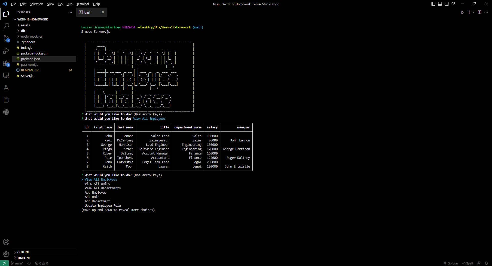

# Homework-Week-12
## Company-Employee-Database

My assignment was to build a command-line application from scratch to manage a company's employee database, using Node.js, Inquirer, and MySQL.

### User Story
```
AS A business owner
I WANT to be able to view and manage the departments, roles, and employees in my company
SO THAT I can organize and plan my business
```

### Table of Contents
1. [Acceptance Criteria](#acceptance-criteria)
2. [Work Description](#work-description)
3. [Tutorial Link](#link-to-video)
4. [Screenshot](#screenshot)
5. [Installation](#installation)
6. [Usage](#usage)
7. [License](#license)
8. [Questions](#questions)

### Acceptance Criteria
```
GIVEN a command-line application that accepts user input
WHEN I start the application
THEN I am presented with the following options: view all departments, view all roles, view all employees, add a department, add a role, add an employee, and update an employee role
WHEN I choose to view all departments
THEN I am presented with a formatted table showing department names and department ids
WHEN I choose to view all roles
THEN I am presented with the job title, role id, the department that role belongs to, and the salary for that role
WHEN I choose to view all employees
THEN I am presented with a formatted table showing employee data, including employee ids, first names, last names, job titles, departments, salaries, and managers that the employees report to
WHEN I choose to add a department
THEN I am prompted to enter the name of the department and that department is added to the database
WHEN I choose to add a role
THEN I am prompted to enter the name, salary, and department for the role and that role is added to the database
WHEN I choose to add an employee
THEN I am prompted to enter the employee’s first name, last name, role, and manager, and that employee is added to the database
WHEN I choose to update an employee role
THEN I am prompted to select an employee to update and their new role and this information is updated in the database 
```

---
[](https://opensource.org/licenses/MIT)

### Work Description
I started by creating the SQL files schema and seed to start table structure and add in useable data. I then started on the console.log end in index and practiced with sql queries as I was still un familiar with their function. I then created the inquirer prompt to ask the users the designed questions, then assigned them to run functions that would run individual queries. I then one by one created the functions to perform the desired task using a collection of functions and queries. Once required functionality was completed I continued onto the bonus objectives where I found a lot of queries shared similar paths to what I had already created. I had a few issues with using for loops and I spent a lot of time figuring out how to achieve the final task of totalling up the salary amounts, after playing around with a lot of different functions of pushing and joining arrays I was able to come up with a good solution that looks for how many employees are in each department and totals that amount. I then went back and cleared up a few queries that I figured out how to optimise better and removed all test console.logs.

### Link To Video

Link For Tutorial Video<br>[Week-11-Assignment-Video](https://drive.google.com/file/d/1xx6WhXOqLy8F6E0-60_WFEzJhJ1cnnHV/view?usp=sharing)

### Screenshot


 
### Installation

For this application express, inquirer, console-table-printer and mysql2 need to be installed. This can be done using npm install in console.

### Usage

express is used as the call location for our server calls and routing. inquirer was used to ask questions through the command line. Console-table-printer is used to print the SQL results into the console in a nicely formatted table. Mysql2 is used to add and retrieve data from sql files and utilise sql queries and the database.

### License

The license I am using for my project is<br>[MIT](https://opensource.org/licenses/MIT)

### Questions

GitHub: [Lucienpep](https://github.com/Lucienpep)<br>

For any further questions contact me via:

Email: <xxyyzzoozz@gmail.com>

---
Lucien Haines UADL 2023
  
